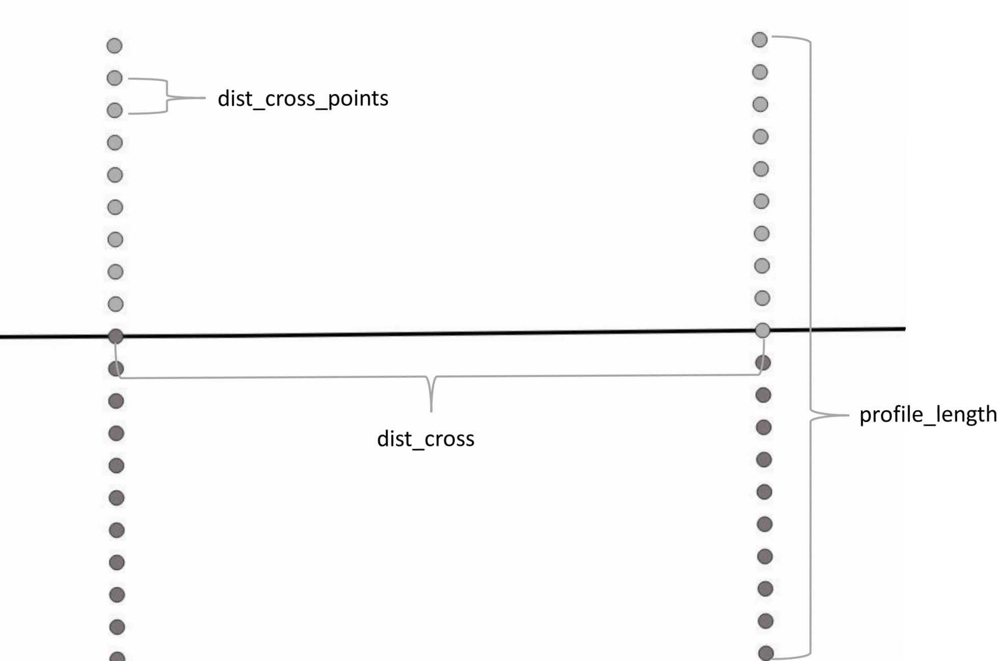
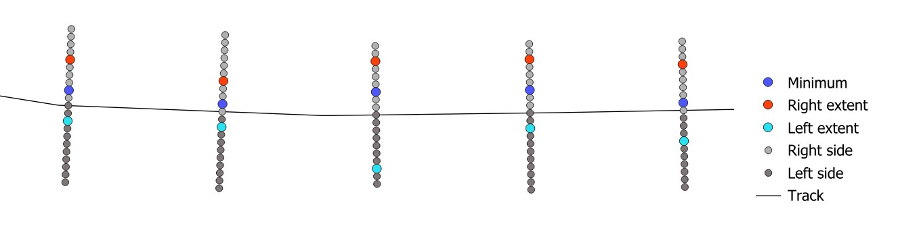

<!-- README.md is generated from README.Rmd. Please edit that file -->

```{r, include = FALSE}
knitr::opts_chunk$set(
  collapse = TRUE,
  comment = "#>",
  fig.path = "man/figures/README-",
  out.width = "100%"
)
```

# checkRtrack

<!-- badges: start -->
<!-- badges: end -->

R package to define track widths. It is created for the course "Introduction to Programming with R" and for my HiWi. 
For now, you can define the lowest points along your track to then define the outer limits of the tracks and visualize your progress. 
The main idea is, that you have digitized (animal)-tracks and a (high resolution) Digital Surface Model (DSM). 
The animals stamping out the grassland could make the width of the path visible with the DSM. The width is defined as the steepest point on each side of the path. With parameters you can adjust your calculations of the width and then always visualize it to check out what is going on. To understand the parameters, please see this [ section 'what are these parameters for?'](#what-are-these-parameters-for?).

The goal is later, to create the mean width for each track segment. 


## Installation

``` {r message=FALSE, warning=FALSE, results="hide" }
# install.packages("devtools")
devtools::install_github("geoniesun/checkRtrack")

# and load it 
library(checkRtrack)
```

## Example Work Flow

The first step would be to load the data - the digitized tracks and the DSM:

``` {r warning=FALSE, results="hide"}
#load tracks 
tracks <- read_tracks(system.file("geopackage/tracks.gpkg", package = "checkRtrack"))
#load dsm
dsm <- read_dsm(system.file("tif/dsm.tif", package = "checkRtrack"))
``` 

For now, it's always best to start with generating the minimumpoints. (Check the setting of the parameters under [the section 'what are these parameters for?'](#what-are-these-parameters-for?)). You can also export the GeoPackage and work on it in QGIS or similar:


``` {r warning=FALSE, message=FALSE}
# create a variable 'mini' to have it ready for the visualization later
mini <- checkMin(dsm, tracks, export = FALSE, dist_cross = 1, profile_length = 1, dist_cross_points = 0.05, st_dev = 0.06)
``` 

Let's have a first look on our minimumpoints. As the entire dataset with all points would be too messy for a quick Map, you will always get a random spot on your tracks that you can have a look on. So just run the line as many times as you want, to have a look on different areas:

``` {r warning=FALSE, message=FALSE}
#creating a random zoom plot of the minimumpoints
checkMap(dsm, tracks, points = mini, export = FALSE)
``` 

Now let's see for the sides. You can go immediately for both sides with 'checkSides()' or look on each one with 'checkRight()' or 'checkLeft()'. For now we go with both:


``` {r warning=FALSE, message=FALSE}
#generate side extend of the path
sides <- checkSides(dsm, tracks, export = FALSE, dist_cross = 1, profile_length = 1, dist_cross_points = 0.05)
``` 

Let's check again the map:

``` {r warning=FALSE, message=FALSE}
#plot random map of minimum and side points
checkMap(dsm, tracks, points = mini, morepoints = sides, export = FALSE)
``` 

Render the checkMap-function as many times as you want... each time will be chosen a random spot on your map.

---

## What are these parameters for?

We have four parameters that we can adjust. They all are related to the crossprofiles that are used to determine the widths. The first three are demonstrated here on this crossprofile example:



With the standarddeviation (st_dev) you can filter the paths (if there is almost no slope, no width will be possible to be calculated with this approach).
Well, the higher the density of your crossprofiles and points, the better the results. 
The goal in future is, making the results independent of the profile length. 
For more understanding, here an overview of what is meant by the "points" that we create with the functions. 




## Roadmap
- [x]  Fix bug: when fade_scr not included, plot looks wrong
- [ ]  Make other vector/raster objects to import possible
- [ ]  Create growing approach for width determination
- [ ]  Visualize the crossprofiles from the side. To see if there is actually a path
- [x]  Take out the fade score as necessary column
- [x]  Generalize all columns
- [ ]  Set more filter that determine a path
- [ ]  Create more options to modify the users definition of the "path end" (for now its the steepest slope point)


## Data sources
Digital Surface Model (DSM) used as example:
© Antonio Jose Castañeda Gomez and the UAS-team of the University of Würzburg

Geopackage data used as example:
© University of Würzburg (digitized by Leonie Sophie Sonntag)
